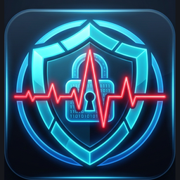

# 🫀 Ritim-EL — ESP32 & BLE Biyometrik Sensör Firmware Katmanı

<div align="center">


<br/>



### **"Kalp Ritminiz, Parolanızdır."**
*TÜBİTAK 2209-A Üniversite Öğrencileri Araştırma Projeleri Destekleme Programı Kapsamında Geliştirilmiştir.*

</div>

---

## 📌 Proje Hakkında

**Ritim-EL**, geleneksel şifreleme ve parmak izi yöntemlerinin ötesine geçerek insan kalbinin benzersiz elektriksel aktivitesini (**EKG - Elektrokardiyogram**) ve fotopletismografi (**PPG - Optik Nabız/SpO2**) sinyallerini işleyen, biyometrik bir kimlik doğrulama ve kiosk güvenlik sistemidir.

Bu depo, projenin **gömülü donanım (embedded hardware), sensör entegrasyonu ve Bluetooth Low Energy (BLE) firmware** kaynak kodlarını içermektedir. Bilekten/vücuttan toplanan analog biyopotansiyel veriler, mikrodenetleyici üzerinde filtrelenerek yüksek hızlı BLE GATT bildirim paketleriyle ana yönetim sistemine aktarılır.

> [!NOTE]
> **Araştırma & Fikri Mülkiyet Gizlilik Bildirimi:**  
> Bu açık kaynaklı depo, TÜBİTAK 2209-A araştırma projesinin **ESP32 Gömülü Donanım & BLE Firmware** mimarisini içermektedir. Çekirdek yapay zeka modelleri (PTB-XL ve ECG-ID veri setleriyle eğitilmiş derin öğrenme / CNN-LSTM transfer learning sınıflandırıcıları), veri tabanı şeması ve kiosk kilit mekanizması araştırma gizliliği ve telif hakları nedeniyle özel depoda (private core repository) korunmaktadır.

---

## ⚡ Donanım Mimarisi ve Sensör Entegrasyonu

Sistem, medikal sınıf sinyal hassasiyetini düşük enerji tüketimiyle birleştiren modüler bir donanım mimarisine sahiptir:

```
┌────────────────────────────────────────────────────────────────────────┐
│                   RİTİM-EL DONANIM BLOK DİYAGRAMI                      │
│                                                                        │
│   ┌─────────────────────┐                                             │
│   │ AD8232 EKG Sensörü  │──(Analog OUT)──┐                            │
│   │ (Biyopotansiyel Ön  │                │                            │
│   │  Yükselteç - 3 Lead)│──(LO+ / LO-)─┐ │                            │
│   └─────────────────────┘              │ │                            │
│                                        │ │  ┌──────────────────────┐  │
│   ┌─────────────────────┐              │ └─►│ ADS1115 16-Bit I2C   │  │
│   │ MAX30102 PPG Sensör │              │    │ Ultra Hassas Harici  ├──┐
│   │ (Optik Nabız/SpO2)  │──(I2C: SDA/SCL)──►│ ADC Modülü           │  │
│   └─────────────────────┘              │    └──────────────────────┘  │
│                                        │                              │
│                                        ▼                              │
│   ┌──────────────────────────────────────────────────────────────┐    │
│   │                 ESP32-WROOM-32 Mikrodenetleyici              │    │
│   │   - 240 MHz Çift Çekirdek Tensilica LX6                      │    │
│   │   - 200 Hz Donanımsal Kesme ile Senkronize Örnekleme         │    │
│   │   - AES-128 Donanımsal Kriptografi & NVS Anti-Replay         │    │
│   │   - Bluetooth Low Energy (BLE 4.2 / 5.0) GATT Sunucusu       │    │
│   └──────────────────────────────┬───────────────────────────────┘    │
│                                  │                                    │
│                                  ▼ (BLE Notification Paketleri)       │
│               [ Masaüstü İstemci / Kiosk Sistemi ]                    │
└────────────────────────────────────────────────────────────────────────┘
```

### 🔌 Pin Bağlantı Şeması

| Bileşen | Sensör Pini | ESP32 / Modül Bağlantısı | Açıklama |
|---|---|---|---|
| **ADS1115 ADC** | SDA | **GPIO 21** | I2C Veri Hattı |
| **ADS1115 ADC** | SCL | **GPIO 22** | I2C Saat Hattı |
| **AD8232 (EKG)** | OUTPUT | **ADS1115 A0** *(veya GPIO 34)* | 16-bit analog EKG sinyali |
| **AD8232 (EKG)** | LO+ | **GPIO 14** | Leads-Off Algılama (Elektrot çıktı uyarısı) |
| **AD8232 (EKG)** | LO- | **GPIO 15** | Leads-Off Algılama |
| **MAX30102 (PPG)**| SDA / SCL | **GPIO 21 / 22** | I2C Ortak Veri Yolu (Optik Nabız/SpO2) |
| **MAX30102 (PPG)**| INT | **GPIO 19** | Örnekleme Kesme Pini (Hardware Interrupt) |

---

## 📡 BLE GATT İletişim Protokolü & Güvenlik

Geleneksel Bluetooth bağlantılarında her ölçümü tek tek iletmek paket gecikmelerine ve veri kaybına yol açar. Bu sorunu çözmek için özel bir paketleme algoritması kurgulanmıştır:

* **200 Hz Örnekleme:** Biyomedikal standartlara uygun olarak saniyede tam 200 EKG ölçümü alınır.
* **Paketleme Stratejisi:** 10'arlı örnekler tamponlanarak (buffer) saniyede 20 kez BLE Notification paketi halinde gönderilir ($20 \times 10 = 200\text{ Hz}$).
* **AES-128 Şifreleme:** Donanımsal şifreleme desteği ile biyometrik sinyaller radyo dalgalarında şifreli akar.
* **NVS Anti-Replay Sayacı:** Cihaz her açıldığında ESP32 NVS (Non-Volatile Storage) belleğinde tutulan sayaç kaldığı yerden devam eder; böylece sinyali kaydedip sonradan tekrar oynatma (replay attack) saldırıları donanımsal düzeyde engellenir.
* **Leads-Off (Elektrot Kopma) Denetimi:** Elektrotlar ciltten ayrıldığında cihaz sinyali otomatik keser ve sisteme uyarı kodu iletir.

---

## 🚀 Kurulum ve Derleme (Arduino IDE)

### 1. Ön Koşullar
1. [Arduino IDE](https://www.arduino.cc/en/software) uygulamasını indirin ve kurun.
2. `Dosya` > `Tercihler` > `Ek Devre Kartları Yöneticisi URL'leri` kısmına ESP32 paket linkini ekleyin:
   ```
   https://raw.githubusercontent.com/espressif/arduino-esp32/gh-pages/package_esp32_index.json
   ```
3. `Araçlar` > `Kart` > `ESP32 Arduino` altından **ESP32 Dev Module** seçin.

### 2. Gerekli Kütüphaneler
Arduino Kütüphane Yöneticisi üzerinden aşağıdaki kütüphaneleri yükleyin:
* `Adafruit ADS1X15` (16-bit ADC sürücüsü)
* `SparkFun MAX3010x Pulse and Proximity Sensor Library`
* `ESP32 BLE Arduino` (ESP32 core ile dahili gelir)

### 3. Kodu Yükleme
1. Bu depoyu klonlayın:
   ```bash
   git clone https://github.com/huseyin-konak/RitimEl-Firmware.git
   ```
2. `firmware/ritim_el_v2_ble/ritim_el_v2_ble.ino` dosyasını Arduino IDE ile açın.
3. Kendi devre pinlerinize göre dosya başındaki `SENIN DEVREN` bloğunu kontrol edin.
4. ESP32 kartınızı USB ile bağlayıp doğru COM portunu seçin ve **Yükle (Upload)** butonuna basın.

---

## 👥 Geliştiriciler

Bu proje, TÜBİTAK 2209-A kapsamında **iki kişilik bir ekip** tarafından bitirme projesi olarak geliştirilmiştir.

| İsim | Bölüm / Rol | GitHub | LinkedIn | İletişim / E-Posta |
|---|---|---|---|---|
| **Hüseyin Konak** | Bilgisayar Mühendisliği Lisans Öğrencisi · Donanım ve Uygulama Geliştirme | [@huseyin-konak](https://github.com/huseyin-konak) | [linkedin.com/in/huseyin-konak](https://www.linkedin.com/in/huseyin-konak/) | [huseyinkonak.dev@gmail.com](mailto:huseyinkonak.dev@gmail.com) |
| **Tolga Karateke** | Geliştirici | – | [Tolga Karateke](https://www.linkedin.com/in/tolga-karateke-8a849a297/) | [ttolgakarateke07900@gmail.com](mailto:ttolgakarateke07900@gmail.com) |

---

## 📜 Lisans & Telif Hakkı

Bu proje **TÜBİTAK 2209-A** araştırma projesi kapsamında geliştirilmiş olup, donanım firmware katmanı [MIT Lisansı](LICENSE) kapsamında açık kaynak olarak paylaşılmıştır.
